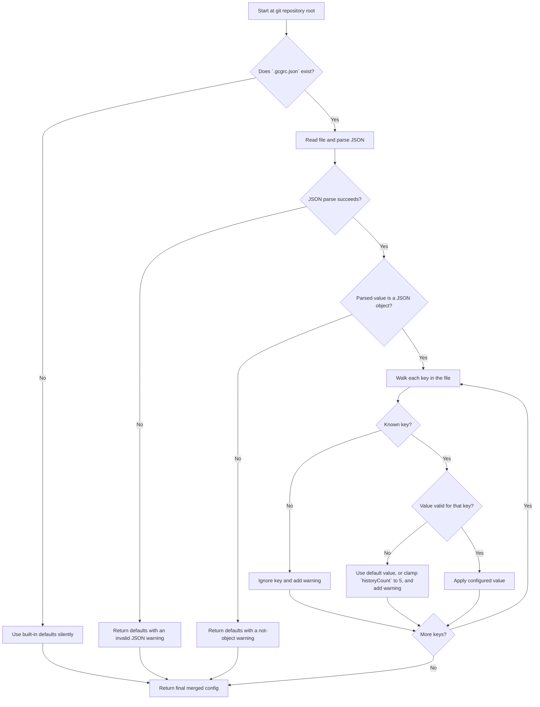

# Configuration

This document explains how `.gcgrc.json` works and what each supported setting does.

## File Location

`gcg` looks for configuration in the git repository root:

```text
<repo-root>/.gcgrc.json
```

It does not currently read from your home directory or a global config location.

## Configuration Loading Flow

This flowchart shows how `gcg` decides whether to use defaults, surface warnings, or apply values from `.gcgrc.json`.



Practical note:
- `src/config.js` collects warning strings and returns them with the config result
- the CLI prints those warnings later during normal execution

## When The File Is Missing

Missing config is normal.

If `.gcgrc.json` does not exist, `gcg` uses built-in defaults silently.

## When The File Is Invalid

If the file exists but contains invalid JSON:
- `gcg` prints a warning
- `gcg` falls back to default settings
- execution continues

If the file is valid JSON but not a JSON object:
- `gcg` prints a warning
- `gcg` falls back to default settings

## Unknown Keys

Unknown keys are ignored with a warning.

That means you can accidentally leave an unsupported key in the file without crashing the CLI, but you will still be told that it is not used.

## Supported Settings

## `autoStage`

- Type: `boolean`
- Default: `false`

When `false`:
- `gcg` uses only the files that are already staged

When `true`:
- `gcg` runs `git add -A` before analysis
- that includes modified, deleted, renamed, and untracked files

Example:

```json
{
  "autoStage": true
}
```

## `historyCount`

- Type: `integer`
- Default: `5`
- Minimum: `5`

This controls how many recent commit titles are provided to Gemini as style reference material.

If you set it below `5`:
- `gcg` prints a warning
- `gcg` uses `5` instead

Example:

```json
{
  "historyCount": 8
}
```

## `notifyOnComplete`

- Type: `boolean`
- Default: `true`

When enabled, `gcg` rings the terminal bell after Gemini finishes generating a message.

Current behavior:
- only bell notification is supported
- there is no OS-specific desktop notification support yet

Example:

```json
{
  "notifyOnComplete": false
}
```

## `strictBranchCheck`

- Type: `boolean`
- Default: `true`

When enabled, `gcg` blocks generation or commit in these branch states:
- behind remote
- diverged from remote
- detached HEAD

When disabled, those checks are skipped.

Example:

```json
{
  "strictBranchCheck": false
}
```

## `fetchBeforeSyncCheck`

- Type: `boolean`
- Default: `false`

When enabled, `gcg` runs `git fetch --quiet` before comparing local and remote branch pointers.

When disabled:
- `gcg` compares against the remote refs already available locally
- this is faster and avoids network dependence, but may be stale

Example:

```json
{
  "fetchBeforeSyncCheck": true
}
```

## Defaults

```json
{
  "autoStage": false,
  "historyCount": 5,
  "notifyOnComplete": true,
  "strictBranchCheck": true,
  "fetchBeforeSyncCheck": false
}
```

## What Is Not Configurable

Some behavior is intentionally fixed for now:

- Gemini model selection is not configurable
- commit message validation mode is not configurable
- diff truncation size is not configurable through `.gcgrc.json`

The goal is to keep the configuration surface small and predictable.

## Practical Examples

## Default staged-only workflow

```json
{
  "autoStage": false
}
```

Use this if you want explicit control over exactly what is analyzed and committed.

## Convenience workflow

```json
{
  "autoStage": true,
  "notifyOnComplete": true
}
```

Use this if you want `gcg` to collect everything automatically and ring when Gemini is done.

## Reduced safety checks for local-only work

```json
{
  "strictBranchCheck": false,
  "fetchBeforeSyncCheck": false
}
```

Use this only if you explicitly do not want branch sync checks to block you.

## Related Docs

- [Getting Started](./getting-started.md)
- [Workflow](./workflow.md)
- [Troubleshooting](./troubleshooting.md)
