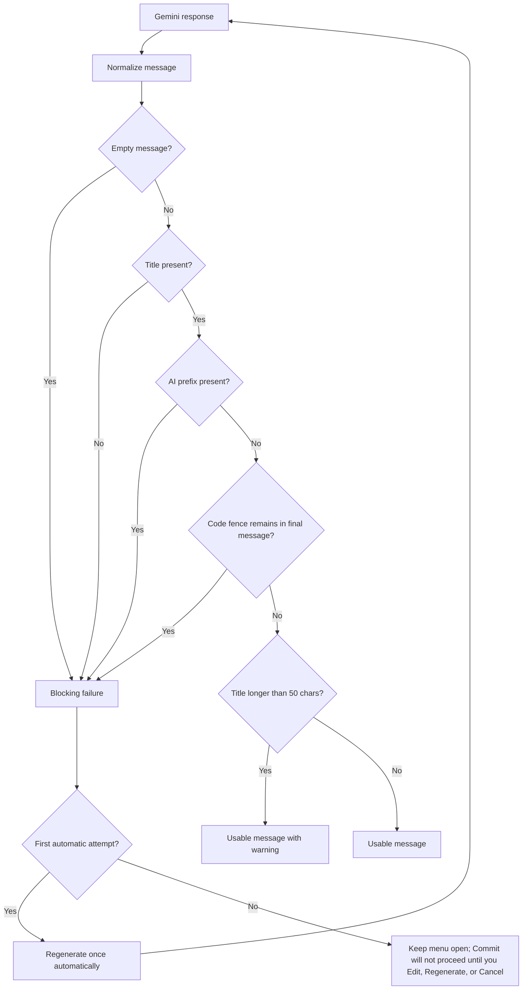

# Validation

This document explains how `gcg` decides whether a Gemini response is usable as a commit message.

## Validation Philosophy

`gcg` uses minimal validation.

It is designed to reject obviously unusable AI output, not to enforce one commit message convention.

That means:
- it does not require Conventional Commits
- it does not require a body
- it does not require a blank line between title and body
- it accepts repository-specific formats such as bracketed prefixes or issue-first titles

## Validation Flow

This diagram shows how `gcg` decides whether a Gemini response can be used directly, should produce a warning, or must be retried/edited.



## Blocking Rules

The message is blocked only when one of these conditions is true.

## Empty message

Blocked example:

```text
<empty output>
```

## Missing title

The final normalized message must contain a non-empty first line.

Blocked example:

```text
""
```

Practical note:
- leading blank lines are trimmed during normalization
- so blank space before real text does not count as a missing-title failure

## Code fences that remain in the final message

If markdown code fences remain after normalization, the message is blocked.

Blocked example:

```text
fix: adjust config loading

```diff
+line
```
```

Important nuance:
- if Gemini wraps the entire response in outer code fences, `gcg` strips those first
- only fences that remain in the final message are treated as blocking

## AI explanatory prefixes

Blocked examples:

```text
Here is your commit message:

fix: adjust config loading
```

```text
Sure, here's a commit message:

fix: adjust config loading
```

```text
다음은 커밋 메시지입니다:

fix: adjust config loading
```

These prefixes are blocked because they are clearly AI wrapper text, not the actual commit message.

## Warning Rules

Warnings do not block commit.

## Title longer than 50 characters

If the first line is longer than 50 characters, `gcg` prints a warning but still allows commit.

This is guidance only, not a hard limit.

## Accepted Styles

These are all acceptable as long as they do not violate the blocking rules.

```text
docs: add trailing newline to AGENTS.md
```

```text
[Docs] LIVD-348 - AGENTS.md 파일 끝에 빈 줄 추가
```

```text
LIVD-348 update AGENTS.md formatting
```

```text
fix signup validation edge case
```

Single-line messages are allowed.

## Regeneration Behavior

When Gemini returns a blocked message:

1. `gcg` retries once automatically
2. if the second result is usable, the flow continues normally
3. if the second result is still blocked, choosing `Commit` will not proceed

At that point you can:
- regenerate again
- edit manually
- cancel

## Edit Behavior

Manual edits are revalidated.

That means:
- warnings are shown again if needed
- blocking issues still prevent commit

Example:
- if you manually save a message with `Here is your commit message:` still present, `gcg` will not commit it

## What Validation Does Not Do

Validation does not:
- enforce Conventional Commits
- require one allowed type list
- require a body
- require title/body blank-line formatting
- check semantic accuracy against the diff

The goal is to keep validation broad and repository-compatible.

## Related Docs

- [Workflow](./workflow.md)
- [Troubleshooting](./troubleshooting.md)
