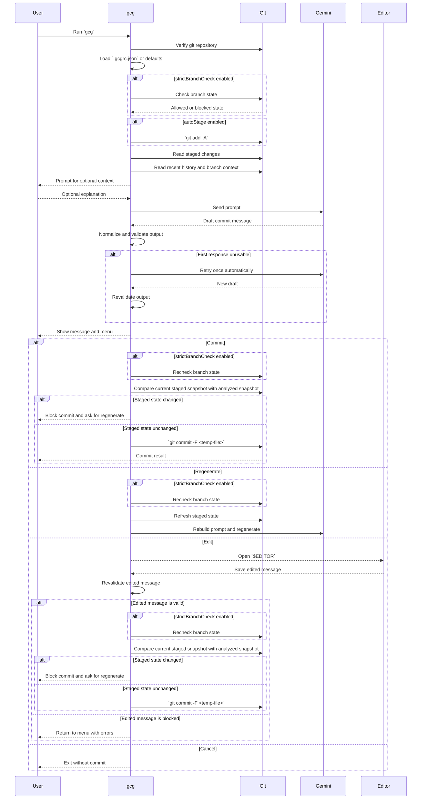

# Workflow

This document explains what `gcg` actually does from startup to commit.

## High-Level Flow

At a high level, `gcg` does this:

1. verifies environment requirements
2. loads `.gcgrc.json` if present
3. optionally checks branch safety
4. gathers staged changes
5. gathers recent commit titles and branch context
6. asks Gemini for a commit message
7. validates the result
8. lets you commit, regenerate, edit, or cancel

## Sequence Diagram

The sequence below shows the main runtime flow and where git, Gemini, and the editor are involved.



## Input Sources

The generated message is influenced by several inputs.

## Staged Changes

This is the primary input.

By default, `gcg` looks only at what is already staged in the git index.

That means:
- unstaged edits are ignored
- untracked files are ignored unless you stage them
- the generated message reflects the staged state captured during analysis

If `autoStage` is enabled, `gcg` runs `git add -A` before analysis.

If the staged set changes after generation, `gcg` does not silently commit the newer staged state with the older message.

Instead, it blocks commit and asks you to regenerate.

## Recent Commit History

`gcg` reads recent commit titles from your repository and sends them to Gemini as style reference material.

This is intended to help Gemini follow the repository's existing tone and structure rather than imposing one fixed style.

The number of titles used comes from `historyCount`.

## Branch Context

`gcg` also sends the current branch name to Gemini.

This is useful when the branch contains:
- issue keys like `ABC-123`
- hash-style references like `#42`
- numeric branch names like `feature/123-login`

These are treated as hints, not hard requirements.

If the branch hint is clearly unrelated to the staged changes, Gemini is expected to ignore it.

## Optional User Context

After the change summary is shown, `gcg` asks for optional free-form context.

This is the right place to explain:
- why the change exists
- product intent
- follow-up work
- migration or rollout context

Example:

```text
improve signup validation and align API errors with onboarding flow
```

## Branch Safety Checks

If `strictBranchCheck` is enabled, `gcg` performs branch checks:
- before the first generation
- before regenerate
- right before commit

It blocks when the current branch is:
- behind remote
- diverged from remote
- detached HEAD

It does not block when:
- no upstream branch exists
- the local branch is ahead of remote

When there is no upstream branch, `gcg` shows a warning and continues.

## Generate

During generation, `gcg` sends Gemini:
- recent commit titles
- branch name and issue hints
- optional user context
- staged basenames only, not full paths
- staged diff content

Large diffs are truncated for prompt safety. Truncation happens at file boundaries when possible.

## Validate

`gcg` uses minimal validation. It does not force a specific commit style.

It only blocks clearly unusable output.

If the first Gemini response is unusable, `gcg` regenerates once automatically.

If the second response is still unusable:
- choosing `Commit` still shows the menu option, but it will not proceed
- you can still regenerate again
- or edit the message manually

## Regenerate

`Regenerate` is not just “ask Gemini again with the old prompt.”

Before regenerating, `gcg`:
- reruns branch safety checks when enabled
- regathers staged state
- rebuilds the prompt from current repository state

That means if you stage or unstage files while the menu is open, regenerate will use the updated staged set.

This is the intended recovery path when `Commit` or `Edit` is blocked because the staged state changed after generation.

## Edit

`Edit` opens your `$EDITOR`.

If `$EDITOR` is not set:
- macOS/Linux fallback: `vi`
- Windows fallback: `notepad`

After editing:
- the message is validated again
- warnings are shown if the title is long
- an empty saved message is treated as a validation failure, not a silent cancel
- blocking issues still prevent commit until you fix them
- if the edited message is valid, `gcg` commits it immediately instead of returning to the menu
- if the staged state changed while the menu was open, `gcg` blocks commit and asks you to regenerate first

## Commit

When you choose `Commit`, `gcg` writes the message to a temporary file and runs:

```text
git commit -F <temp-file>
```

This avoids shell escaping problems with quotes, newlines, and special characters inside the commit message.

Before that commit step runs, `gcg` compares the current staged snapshot with the one used for generation.

If they differ, `gcg` blocks the commit so the message is not applied to a different staged set.

## Cancel

`Cancel` exits without running `git commit`.

Important detail:
- if `autoStage` is `false`, `gcg` does not create new staged changes
- if `autoStage` is `true`, the staging done earlier is not rolled back on cancel

## Related Docs

- [Configuration](./configuration.md)
- [Validation](./validation.md)
- [Troubleshooting](./troubleshooting.md)
